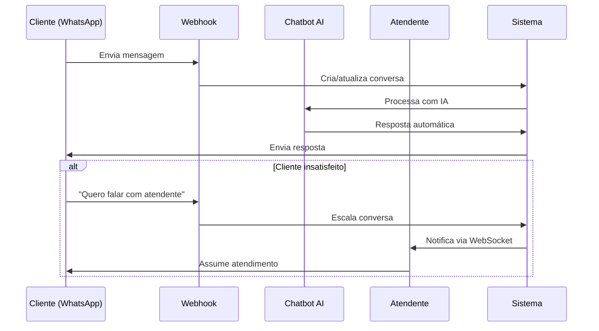

# 🔧 Exemplos Práticos da API

## Casos de Uso Comuns

### 1. Fluxo Completo de Atendimento



---

### 2. Autenticação e Sessão

```python
import requests
from datetime import datetime, timedelta
import json

class ChatAPIClient:
    """Cliente para a API de Chat de Atendimento."""
    
    def __init__(self, base_url: str = "http://localhost:8000/api/v1"):
        self.base_url = base_url
        self.token = None
        self.token_expiry = None
        self.session = requests.Session()
    
    def login(self, email: str, password: str) -> dict:
        """Autenticar e armazenar token."""
        response = self.session.post(
            f"{self.base_url}/auth/login",
            json={"email": email, "password": password}
        )
        response.raise_for_status()
        
        data = response.json()
        self.token = data["access_token"]
        self.token_expiry = datetime.now() + timedelta(seconds=data["expires_in"])
        self.session.headers.update({
            "Authorization": f"Bearer {self.token}"
        })
        
        return data
    
    def is_authenticated(self) -> bool:
        """Verificar se token é válido."""
        if not self.token:
            return False
        return datetime.now() < self.token_expiry
    
    def logout(self):
        """Fazer logout."""
        if self.token:
            self.session.post(f"{self.base_url}/auth/logout")
            self.token = None
            self.token_expiry = None
            del self.session.headers["Authorization"]


# Uso
client = ChatAPIClient()
client.login("atendente@empresa.com", "senha123")
print(f"Autenticado: {client.is_authenticated()}")
```

---

### 3. Gerenciamento de Conversas

```python
class ConversationManager:
    """Gerenciador de conversas."""
    
    def __init__(self, api_client: ChatAPIClient):
        self.client = api_client
    
    def list_active(self, status: str = "in_progress") -> list:
        """Listar conversas ativas."""
        response = self.client.session.get(
            f"{self.client.base_url}/conversations",
            params={"status": status}
        )
        response.raise_for_status()
        return response.json()["conversations"]
    
    def get_messages(self, conversation_id: str) -> list:
        """Obter mensagens de uma conversa."""
        response = self.client.session.get(
            f"{self.client.base_url}/conversations/{conversation_id}"
        )
        response.raise_for_status()
        return response.json()["messages"]
    
    def send_message(self, conversation_id: str, content: str) -> dict:
        """Enviar mensagem em uma conversa."""
        response = self.client.session.post(
            f"{self.client.base_url}/conversations/{conversation_id}/messages",
            json={"content": content, "type": "text"}
        )
        response.raise_for_status()
        return response.json()
    
    def transfer(self, conversation_id: str, to_agent_id: int, reason: str) -> dict:
        """Transferir conversa para outro atendente."""
        response = self.client.session.post(
            f"{self.client.base_url}/conversations/{conversation_id}/transfer",
            json={"to_agent_id": to_agent_id, "reason": reason}
        )
        response.raise_for_status()
        return response.json()
    
    def close(self, conversation_id: str, resolution: str = "resolved", notes: str = "") -> dict:
        """Encerrar conversa."""
        response = self.client.session.post(
            f"{self.client.base_url}/conversations/{conversation_id}/close",
            json={"resolution": resolution, "notes": notes}
        )
        response.raise_for_status()
        return response.json()


# Uso
conversations = ConversationManager(client)

# Listar conversas na fila
queue = conversations.list_active(status="queue")
print(f"Conversas na fila: {len(queue)}")

# Pegar primeira conversa da fila e responder
if queue:
    conv = queue[0]
    messages = conversations.get_messages(conv["id"])
    print(f"Cliente disse: {messages[-1]['content']}")
    
    # Responder
    conversations.send_message(conv["id"], "Olá! Vou verificar isso para você.")
```

---

### 4. Integração WhatsApp

```python
class WhatsAppManager:
    """Gerenciador de WhatsApp."""
    
    def __init__(self, api_client: ChatAPIClient):
        self.client = api_client
    
    def send_text(self, phone: str, message: str) -> dict:
        """Enviar mensagem de texto."""
        response = self.client.session.post(
            f"{self.client.base_url}/whatsapp/send",
            json={
                "to": phone,
                "type": "text",
                "content": message
            }
        )
        response.raise_for_status()
        return response.json()
    
    def send_template(
        self, 
        phone: str, 
        template_name: str, 
        params: list = None,
        language: str = "pt_BR"
    ) -> dict:
        """Enviar template pré-aprovado."""
        components = []
        if params:
            components.append({
                "type": "body",
                "parameters": [
                    {"type": "text", "text": p} for p in params
                ]
            })
        
        response = self.client.session.post(
            f"{self.client.base_url}/whatsapp/send-template",
            json={
                "to": phone,
                "template_name": template_name,
                "language": language,
                "components": components
            }
        )
        response.raise_for_status()
        return response.json()
    
    def send_image(self, phone: str, image_url: str, caption: str = "") -> dict:
        """Enviar imagem."""
        response = self.client.session.post(
            f"{self.client.base_url}/whatsapp/send",
            json={
                "to": phone,
                "type": "image",
                "content": {
                    "url": image_url,
                    "caption": caption
                }
            }
        )
        response.raise_for_status()
        return response.json()


# Uso
whatsapp = WhatsAppManager(client)

# Enviar mensagem simples
whatsapp.send_text("+5511999999999", "Olá! Sua internet foi normalizada.")

# Enviar template de boas-vindas
whatsapp.send_template(
    phone="+5511999999999",
    template_name="boas_vindas",
    params=["João"]
)

# Enviar imagem com instruções
whatsapp.send_image(
    phone="+5511999999999",
    image_url="https://empresa.com/tutorial-modem.jpg",
    caption="Veja como resetar seu modem"
)
```

---

### 5. Chatbot com IA

```python
class ChatbotManager:
    """Gerenciador do Chatbot IA."""
    
    def __init__(self, api_client: ChatAPIClient):
        self.client = api_client
    
    def process_message(
        self, 
        conversation_id: str, 
        message: str,
        context: dict = None
    ) -> dict:
        """Processar mensagem com IA."""
        payload = {
            "conversation_id": conversation_id,
            "message": message
        }
        if context:
            payload["context"] = context
        
        response = self.client.session.post(
            f"{self.client.base_url}/chatbot/message",
            json=payload
        )
        response.raise_for_status()
        return response.json()
    
    def escalate(self, conversation_id: str, reason: str) -> dict:
        """Escalar para atendente humano."""
        response = self.client.session.post(
            f"{self.client.base_url}/chatbot/escalate",
            json={
                "conversation_id": conversation_id,
                "reason": reason
            }
        )
        response.raise_for_status()
        return response.json()


# Uso
chatbot = ChatbotManager(client)

# Processar mensagem do cliente
response = chatbot.process_message(
    conversation_id="550e8400-e29b-41d4-a716-446655440000",
    message="Minha internet está muito lenta há 2 dias",
    context={
        "customer_name": "João Silva",
        "customer_plan": "Fibra 100 Mbps",
        "customer_since": "2024-01-15"
    }
)

print(f"Resposta IA: {response['response']}")
print(f"Intenção detectada: {response['intent']}")
print(f"Confiança: {response['confidence']}")
print(f"Deve escalar: {response['should_transfer']}")

# Se IA não conseguir resolver
if response['should_transfer']:
    chatbot.escalate(
        conversation_id="550e8400-e29b-41d4-a716-446655440000",
        reason="Problema técnico requer atendente especializado"
    )
```

---

### 6. Dashboard e Métricas

```python
class DashboardManager:
    """Gerenciador do Dashboard."""
    
    def __init__(self, api_client: ChatAPIClient):
        self.client = api_client
    
    def get_metrics(self) -> dict:
        """Obter métricas em tempo real."""
        response = self.client.session.get(
            f"{self.client.base_url}/dashboard/metrics"
        )
        response.raise_for_status()
        return response.json()
    
    def get_agents_status(self) -> list:
        """Obter status dos atendentes."""
        response = self.client.session.get(
            f"{self.client.base_url}/dashboard/agents"
        )
        response.raise_for_status()
        return response.json()["agents"]
    
    def get_queue(self) -> dict:
        """Obter fila de espera."""
        response = self.client.session.get(
            f"{self.client.base_url}/dashboard/queue"
        )
        response.raise_for_status()
        return response.json()


# Uso
dashboard = DashboardManager(client)

# Métricas em tempo real
metrics = dashboard.get_metrics()
print(f"Conversas ativas: {metrics['conversations']['active']}")
print(f"Na fila: {metrics['conversations']['in_queue']}")
print(f"Atendentes online: {metrics['agents']['online']}")
print(f"Tempo médio de resposta: {metrics['performance']['avg_response_time_seconds']}s")

# Status dos atendentes
agents = dashboard.get_agents_status()
for agent in agents:
    print(f"{agent['nome']}: {agent['status']} - {agent['current_conversations']}/{agent['max_conversations']} conversas")
```

---

### 7. WebSocket - Tempo Real

```python
import asyncio
import websockets
import json

class WebSocketClient:
    """Cliente WebSocket para eventos em tempo real."""
    
    def __init__(self, base_url: str, token: str):
        self.url = base_url.replace("http", "ws") + f"/ws/chat?token={token}"
        self.websocket = None
        self.handlers = {}
    
    def on(self, event_type: str):
        """Decorator para registrar handlers de eventos."""
        def decorator(func):
            self.handlers[event_type] = func
            return func
        return decorator
    
    async def connect(self):
        """Conectar ao WebSocket."""
        self.websocket = await websockets.connect(self.url)
        print("Conectado ao WebSocket")
    
    async def disconnect(self):
        """Desconectar."""
        if self.websocket:
            await self.websocket.close()
    
    async def send(self, event_type: str, data: dict):
        """Enviar mensagem."""
        message = {"type": event_type, **data}
        await self.websocket.send(json.dumps(message))
    
    async def join_conversation(self, conversation_id: str):
        """Entrar em uma conversa."""
        await self.send("join_conversation", {"conversation_id": conversation_id})
    
    async def send_message(self, conversation_id: str, content: str):
        """Enviar mensagem na conversa."""
        await self.send("send_message", {
            "conversation_id": conversation_id,
            "content": content,
            "message_type": "text"
        })
    
    async def start_typing(self, conversation_id: str):
        """Indicar que está digitando."""
        await self.send("typing_start", {"conversation_id": conversation_id})
    
    async def stop_typing(self, conversation_id: str):
        """Parar indicador de digitação."""
        await self.send("typing_stop", {"conversation_id": conversation_id})
    
    async def listen(self):
        """Escutar eventos."""
        async for message in self.websocket:
            data = json.loads(message)
            event_type = data.get("type")
            
            if event_type in self.handlers:
                await self.handlers[event_type](data)
            else:
                print(f"Evento não tratado: {event_type}")


# Uso
async def main():
    ws = WebSocketClient("http://localhost:8000", client.token)
    
    # Registrar handlers
    @ws.on("new_message")
    async def on_new_message(data):
        print(f"Nova mensagem: {data['content']}")
    
    @ws.on("agent_typing")
    async def on_typing(data):
        print(f"Atendente {data['agent_id']} está digitando...")
    
    @ws.on("conversation_assigned")
    async def on_assigned(data):
        print(f"Nova conversa atribuída: {data['conversation_id']}")
        # Entrar automaticamente na conversa
        await ws.join_conversation(data['conversation_id'])
    
    @ws.on("queue_update")
    async def on_queue_update(data):
        print(f"Posição na fila: {data['position']}")
    
    # Conectar e escutar
    await ws.connect()
    await ws.listen()


# Rodar
# asyncio.run(main())
```

---

### 8. Script de Automação - Campanha de Mensagens

```python
import time
from typing import List, Dict

class CampaignManager:
    """Gerenciador de campanhas de mensagens."""
    
    def __init__(self, api_client: ChatAPIClient):
        self.client = api_client
        self.whatsapp = WhatsAppManager(api_client)
    
    def send_bulk_template(
        self,
        contacts: List[Dict],
        template_name: str,
        delay_seconds: float = 1.0
    ) -> Dict:
        """Enviar template para múltiplos contatos."""
        results = {
            "success": 0,
            "failed": 0,
            "errors": []
        }
        
        for contact in contacts:
            try:
                self.whatsapp.send_template(
                    phone=contact["phone"],
                    template_name=template_name,
                    params=contact.get("params", [])
                )
                results["success"] += 1
                print(f"✓ Enviado para {contact['phone']}")
            except Exception as e:
                results["failed"] += 1
                results["errors"].append({
                    "phone": contact["phone"],
                    "error": str(e)
                })
                print(f"✗ Falha para {contact['phone']}: {e}")
            
            # Respeitar rate limit
            time.sleep(delay_seconds)
        
        return results


# Uso
campaign = CampaignManager(client)

# Lista de clientes para campanha
contacts = [
    {"phone": "+5511999999991", "params": ["João", "50"]},
    {"phone": "+5511999999992", "params": ["Maria", "100"]},
    {"phone": "+5511999999993", "params": ["Pedro", "200"]},
]

# Enviar campanha promocional
results = campaign.send_bulk_template(
    contacts=contacts,
    template_name="promocao_upgrade",
    delay_seconds=1.0  # 1 segundo entre cada envio
)

print(f"\nResultados da campanha:")
print(f"Sucesso: {results['success']}")
print(f"Falhas: {results['failed']}")
```

---

### 9. Monitoramento de Saúde

```python
import requests
from datetime import datetime

def check_health(base_url: str = "http://localhost:8000") -> dict:
    """Verificar saúde do sistema."""
    try:
        response = requests.get(f"{base_url}/health", timeout=10)
        data = response.json()
        
        all_healthy = all(
            status == "healthy" 
            for status in data["services"].values()
        )
        
        return {
            "status": "ok" if all_healthy else "degraded",
            "timestamp": datetime.now().isoformat(),
            "api_version": data["version"],
            "services": data["services"]
        }
    except requests.exceptions.Timeout:
        return {"status": "timeout", "timestamp": datetime.now().isoformat()}
    except requests.exceptions.ConnectionError:
        return {"status": "unreachable", "timestamp": datetime.now().isoformat()}
    except Exception as e:
        return {"status": "error", "error": str(e), "timestamp": datetime.now().isoformat()}


# Monitoramento contínuo
def monitor_health(interval_seconds: int = 30):
    """Monitorar saúde continuamente."""
    while True:
        health = check_health()
        
        if health["status"] != "ok":
            # Aqui você pode enviar alerta via email, Slack, etc.
            print(f"⚠️ ALERTA: Sistema {health['status']} em {health['timestamp']}")
            if "services" in health:
                for service, status in health["services"].items():
                    if status != "healthy":
                        print(f"  - {service}: {status}")
        else:
            print(f"✓ Sistema saudável em {health['timestamp']}")
        
        time.sleep(interval_seconds)


# monitor_health(30)
```

---

### 10. Exemplo Completo - Atendente Virtual

```python
"""
Exemplo de atendente virtual que:
1. Conecta via WebSocket
2. Recebe notificações de novas conversas
3. Processa mensagens com IA
4. Escala para humano quando necessário
"""

import asyncio
import websockets
import json

class VirtualAgent:
    """Atendente virtual automatizado."""
    
    def __init__(self, base_url: str, email: str, password: str):
        self.api = ChatAPIClient(base_url)
        self.api.login(email, password)
        
        self.chatbot = ChatbotManager(self.api)
        self.conversations = ConversationManager(self.api)
        self.whatsapp = WhatsAppManager(self.api)
        
        self.active_conversations = set()
    
    async def start(self):
        """Iniciar atendente virtual."""
        ws_url = self.api.base_url.replace("http", "ws") + f"/ws/chat?token={self.api.token}"
        
        async with websockets.connect(ws_url) as websocket:
            print("🤖 Atendente virtual iniciado")
            
            async for message in websocket:
                await self.handle_event(websocket, json.loads(message))
    
    async def handle_event(self, websocket, event: dict):
        """Processar evento recebido."""
        event_type = event.get("type")
        
        if event_type == "conversation_assigned":
            await self.handle_new_conversation(websocket, event)
        
        elif event_type == "new_message":
            await self.handle_message(websocket, event)
    
    async def handle_new_conversation(self, websocket, event: dict):
        """Nova conversa atribuída."""
        conv_id = event["conversation_id"]
        self.active_conversations.add(conv_id)
        
        # Entrar na conversa
        await websocket.send(json.dumps({
            "type": "join_conversation",
            "conversation_id": conv_id
        }))
        
        print(f"📩 Nova conversa: {conv_id}")
        
        # Enviar saudação inicial
        self.conversations.send_message(
            conv_id,
            "Olá! Sou o assistente virtual da TechISP. Como posso ajudar?"
        )
    
    async def handle_message(self, websocket, event: dict):
        """Processar nova mensagem."""
        conv_id = event["conversation_id"]
        content = event["content"]
        
        if event["direction"] != "incoming":
            return
        
        print(f"💬 Mensagem de {conv_id}: {content[:50]}...")
        
        # Indicar que está digitando
        await websocket.send(json.dumps({
            "type": "typing_start",
            "conversation_id": conv_id
        }))
        
        # Processar com IA
        try:
            response = self.chatbot.process_message(
                conversation_id=conv_id,
                message=content,
                context=event.get("context", {})
            )
            
            # Verificar se deve escalar
            if response.get("should_transfer"):
                self.chatbot.escalate(conv_id, "Transferência solicitada pela IA")
                self.conversations.send_message(
                    conv_id,
                    "Vou transferir você para um de nossos especialistas. Um momento!"
                )
                self.active_conversations.discard(conv_id)
            else:
                # Enviar resposta da IA
                self.conversations.send_message(conv_id, response["response"])
            
            # Parar indicador de digitação
            await websocket.send(json.dumps({
                "type": "typing_stop",
                "conversation_id": conv_id
            }))
            
        except Exception as e:
            print(f"❌ Erro ao processar mensagem: {e}")
            # Em caso de erro, escalar para humano
            self.chatbot.escalate(conv_id, f"Erro no chatbot: {e}")


# Executar atendente virtual
async def run_virtual_agent():
    agent = VirtualAgent(
        base_url="http://localhost:8000/api/v1",
        email="bot@empresa.com",
        password="bot_password_123"
    )
    
    try:
        await agent.start()
    except KeyboardInterrupt:
        print("Atendente virtual encerrado")


# asyncio.run(run_virtual_agent())
```

---

## 📌 Notas Importantes

1. **Rate Limiting**: Respeite os limites de requisições para evitar bloqueios
2. **Token Refresh**: Renove o token antes de expirar (24h)
3. **WebSocket**: Use ping/pong para manter a conexão ativa
4. **Webhooks**: Sempre valide a assinatura das requisições do WhatsApp
5. **Templates**: Templates do WhatsApp precisam ser pré-aprovados pela Meta
